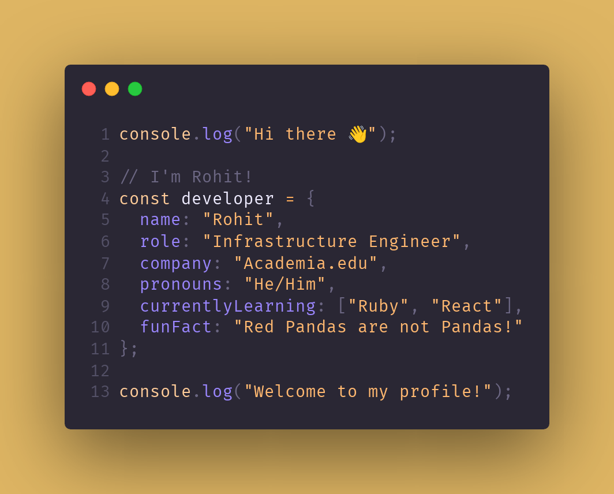

<div align="center">



</div>

<table>
<tr>
<td width="50%" valign="top">

```bash
$ ps aux | grep "anime"
Currently watching:
  Smoking Behind the Supermarket with You
  Hell’s Paradise Season 2
  The Angel Next Door Spoils Me Rotten2
  Assassination Classroom the Movie: Our Time
  Journal with Witch

$ echo "Anime processes active"
```

</td>
<td width="50%" valign="top">

```bash
$ ps aux | grep "manga"
Currently reading:
  SPY x FAMILY
  I Have a Crush at Work
  Yotsuba&!
  The Fragrant Flower Blooms With Dignity
  Konbini de Kimi to no 5-funkan

$ echo "Manga processes active"
```

</td>
</tr>
</table>

<table>
<tr>
<td width="50%" valign="top">

```bash
$ whoami
rohit@dev:~$

$ cat ~/.media_stats
anime_completed=244
time_watched="50d 12h"
manga_completed=129
chapters_read="12.4k"

$ echo $FAVORITE_GENRES
comedy romance slice_of_life

$ uptime
Life uptime: Making things work since forever

$ echo "System stats loaded successfully"
All entertainment metrics up to date
```

</td>
<td width="50%" valign="top">

<div align="center">

[](https://spotify-github-profile.kittinanx.com/api/view?uid=infernapexavier&redirect=true)

</div>

</td>
</tr>
</table>

<table>
<tr>
<td width="100%" valign="top">

*My current top songs*

| Cover | Track | Artist |
|-------|-------|--------|
 | **[オリオン](https://open.spotify.com/track/6VpeCZDyuFJD3HW5bwEc8Z)** | *YOASOBI*
 | **[Ponyboy](https://open.spotify.com/track/593kawmuK8Zkl8iHfeSESv)** | *Royal & the Serpent*
 | **[Need Somebody](https://open.spotify.com/track/0Gb779X0uAvyDpS8ErjBU3)** | *BENJAMINRICH, sindr*
 | **[Dragonborn](https://open.spotify.com/track/1jLmVI46Yf0jzQkugZReIn)** | *Jeremy Soule, The Elder Scrolls*
 | **[Game Time](https://open.spotify.com/track/4KIRA3oOWWyYhuQkuoHnFr)** | *Future, Tyla, FIFA Sound*

</td>
</tr>
</table>